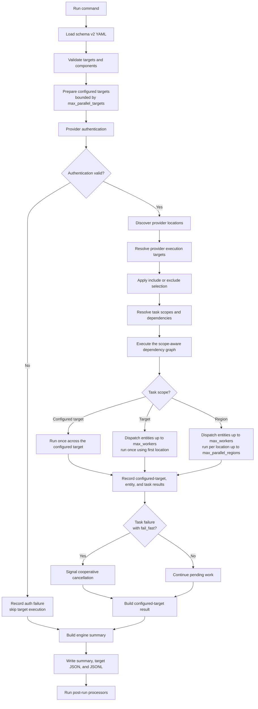

# Execution Model

Anvil turns each schema v2 configured target into provider-specific execution
targets, then runs compatible tasks across the resolved region or location
scope. The same engine pipeline supports every stock and extension provider.

At a high level:

1. Load and validate schema v2 YAML.
2. Discover providers, tasks, and processors without eagerly importing every
   component implementation.
3. Authenticate each configured target and reuse equivalent auth checks within
   the run.
4. Ask the provider to discover locations and resolve execution targets.
5. Apply configured and CLI `include` or `exclude` selection.
6. Validate task compatibility, scope, and dependency order.
7. Execute configured targets concurrently up to `max_parallel_targets`.
8. Execute resolved entities concurrently up to each target's `max_workers`.
9. Run configured-target, target, or region task streams with optional region
   concurrency.
10. Write structured results and run configured processors.

## Flow



## Configured Targets and Execution Targets

A YAML `targets` item is a configured target. Its provider turns that
configuration into zero or more execution targets, called entities in results
and the CLI.

| Provider mode | Configured target resolves to |
| --- | --- |
| AWS `organization` | discovered AWS accounts |
| AWS `accounts` | explicitly selected AWS accounts |
| Azure `tenant` | discovered Azure subscriptions |
| Azure `subscriptions` | explicitly selected Azure subscriptions |
| Cloudflare `accounts` | discovered or explicitly selected accounts |
| Cloudflare `zones` | discovered or explicitly selected zones |
| Datadog `organization` | one configured organization |
| GCP `organization` | reserved; organization discovery is not currently implemented |
| GCP `projects` | explicitly selected projects, or accessible project discovery when `include` is omitted |
| GitHub `organizations` | organization entities for dedicated code search, or discovered repositories beneath selected owners |
| GitHub `repositories` | selected `owner/repository` targets |
| GitLab `groups` | discovered or explicitly selected groups |
| GitLab `projects` | discovered or explicitly selected projects |
| PagerDuty `account` | one configured account |

Provider-specific IDs and display names are normalized into the runtime fields
`execution_target_id`, `execution_target_name`, and `execution_target_type`.
This lets the runner and result model stay provider-neutral while sessions and
task logic remain provider-aware.

## Regions, Locations, and Task Scope

Anvil uses `region` as the common runtime name for a provider location:

- AWS discovers enabled regions and resolves explicit values, `all`, or globs.
- Azure and GCP resolve configured cloud locations.
- Cloudflare, Datadog, GitHub, GitLab, and PagerDuty use `global`.

Region-scoped tasks run once per execution-target/location pair. Target-scoped
tasks declare `TASK_SCOPE = "target"` and run once per entity with the first
resolved location. AWS additionally supports `TASK_SCOPE = "configured_target"`
for one invocation across the complete configured YAML target. Providers
advertise their supported scopes, and validation rejects incompatible
task/provider combinations before work starts.

Tasks execute in dependency order within each stream. Multiple locations may
run concurrently up to `max_parallel_regions`, but each location preserves task
dependency order. Scope-aware dependencies can fan configured-target results
out to entity or region tasks and fan region results back into a
configured-target consumer. Result ordering remains deterministic even when
workers finish out of order.

## Bounded Concurrency

Concurrency is controlled at three levels:

```text
configured targets: max_parallel_targets
entities per target: max_workers
locations per entity: max_parallel_regions
```

For a target whose tasks are all region-scoped, a rough upper bound on active
task streams is:

```text
max_parallel_targets * max_workers * max_parallel_regions
```

Target-scoped tasks reduce that number because they run once per entity. Actual
parallelism may also be lower because discovery, dependency ordering, provider
serialization, failures, or the number of resolved targets and locations bound
the work.

Provider APIs have different rate and concurrency limits. Increase the three
controls gradually and benchmark against the real task mix.

## Fail-Fast and Cancellation

A task failure fails its current task stream. When `fail_fast` is enabled,
Anvil also signals cancellation to pending entity and location work for that
configured target.

Cancellation is cooperative. Work that has not started can be cancelled;
already-running tasks are not forcefully terminated. Workers check the shared
signal before starting more tasks or locations and return structured interrupted
results where appropriate.

Tasks whose dependencies failed are recorded as blocked rather than executed.
Use an `always_run` dependent for cleanup that must execute after an
unsuccessful dependency settles.

## Provider Sessions and Authentication

Providers own authentication, discovery, and session construction:

- AWS uses boto3 profiles or the normal AWS credential chain, optionally
  assumes a role into selected accounts, and creates region-scoped sessions.
- Azure uses explicit service-principal settings or `DefaultAzureCredential`
  and creates subscription/location sessions.
- Cloudflare uses token or global API-key credentials and creates account/zone
  client contexts.
- Datadog uses API/application key pairs bound to one organization and site.
- GCP uses a credentials file or application-default credentials and creates
  project/location sessions.
- GitHub uses tokens, app credentials, profiles, or supported local credential
  fallbacks and creates owner/repository client contexts.
- GitLab uses private-token or OAuth authentication for group/project clients.
- PagerDuty uses token or bearer authentication for one account context.

`anvil validate --auth` exercises the provider's access check without running
tasks. During a run, equivalent credential identities can share a single-flight
auth outcome while every configured target still receives its own auth result.

## Cache and Reuse Boundaries

Anvil keeps caches deliberately narrow:

- component catalogs cache discovered names and sources without eager child
  imports
- selected task and processor callables are cached in-process
- packaged schema and validation data are cached in-process
- authentication and provider discovery may be reused within one run
- provider sessions and clients are scoped to safe credential, entity, thread,
  or location boundaries

### AWS Runtime Reuse

AWS preserves specialized organization behavior from earlier releases:

- same-organization targets can reuse active-account and region discovery
- single-flight coordination prevents duplicate concurrent discovery
- thread-local base sessions avoid mixing profile and region context
- member-account role credentials are reused across regions and refreshed when
  they approach expiration
- boto3 clients are lazily cached within one account-region task stream

These caches reduce setup and discovery work; they do not cache provider API
responses made by tasks.

### GitHub Runtime Reuse

GitHub fingerprints credential identity without putting secrets in cache keys.
It reuses suitable clients and coordinates installation-client construction so
concurrent work does not repeatedly build the same GitHub App installation
client.

Run-scoped caches are not written to disk and do not carry discovery or auth
outcomes into a later command.

## Result Model

Results have four useful layers:

- task result: one task outcome for a configured target, entity, or location
- entity result: all task outcomes for one provider execution target
- target result: all entities for one configured YAML target
- engine result: the full run across configured targets

The run directory contains a compact `summary.json`, one full JSON document per
configured target beneath `targets/`, and flattened entity/task records in
`results.jsonl`. This provider-neutral result shape powers querying, processors,
and targeted reruns.
