# Execution Model

Anvil executes declarative task workflows across one or more AWS organizations,
many accounts within each organization, and one or more configured AWS regions.

At a high level:

1. Each target is defined independently in YAML.
2. Each target declares its own profile, role, regions, worker limits, region
   concurrency, task graph, account filters, dry-run behavior, fail-fast
   behavior, and metadata.
3. Each YAML can declare `max_parallel_targets` to bound how many configured
   targets may execute at once.
4. Anvil validates YAML against the packaged JSON Schema and semantic target
   rules before execution starts.
5. Organization targets authenticate, create an organization-scoped base
   session, discover eligible accounts, discover region statuses, validate
   configured regions, and build the effective account execution set.
6. Accounts execute in parallel within a target, bounded by `max_workers`.
7. Within an account, tasks execute in dependency order for each effective
   region, optionally bounded by `max_parallel_regions`.
8. Results are captured at task, account, target, and engine scope.

This model is designed for workflows that need consistent execution across
multiple AWS organizations while still respecting account boundaries,
region-specific service presence, and per-organization execution settings.

## Flow

```mermaid
flowchart TD
    A["Run command"] --> B["Load YAML"]
    B --> C["Start target pipeline"]

    C --> D["Prepare targets in parallel<br/>bounded by<br/>max parallel targets"]
    D --> E{"Target prepared"}
    E --> F["Auth check"]
    F --> G{"Auth OK?"}

    G -->|No| H["Record auth result<br/>skip execution"]
    G -->|Yes| I["Apply run-time overrides"]
    I --> J["Resolve task graph"]
    J --> K["Build execution context"]
    K --> L["Ready queue"]

    L --> M{"Execution slot open<br/>and org not already active?"}
    M -->|No| N["Wait in ready queue"]
    M -->|Yes| O{"Target type?"}

    O -->|Organization| P1
    O -->|Accounts| Q1

    subgraph LEFT["Organization target"]
        direction TD
        P1["Create base session"]
        P1 --> P2["Read org identity"]
        P2 --> P3["Discover active accounts"]
        P3 --> P4["Discover region statuses"]
        P4 --> P5["Validate configured regions"]
        P5 --> P6["Apply include/exclude filters"]
        P6 --> P7["Build account list"]
    end

    subgraph RIGHT["Explicit accounts target"]
        direction TD
        Q1["Create base session"]
        Q1 --> Q2["Read explicit account list"]
        Q2 --> Q3["Build account list"]
    end

    P7 --> R["Create account worker pool"]
    Q3 --> R

    R --> S["Dispatch accounts in parallel<br/>bounded by per-target max workers"]
    S --> T["Worker executes one account"]

    T --> U{"Management account?"}
    U -->|Yes| V["Reuse worker session<br/>for region"]
    U -->|No| W["Assume role once<br/>for account"]
    W --> X["Create region session<br/>from assumed credentials"]

    V --> C1["Wrap account-region session<br/>with lazy client cache"]
    X --> C1
    C1 --> Y["Run tasks by region<br/>in dependency order"]

    Y --> YA{"More tasks or regions?"}
    YA -->|Yes| Y
    YA -->|No| Z{"Failure with fail-fast?"}

    Z -->|No| AA["Continue account work"]
    Z -->|Yes| AB["Set cancellation signal"]
    AB --> AC["Stop pending account work"]

    AA --> AD["Account result"]
    AC --> AD

    AD --> AE["Target result"]
    AE --> AF["Release org slot if needed"]
    AF --> AG["Record target result<br/>in input order"]

    H --> AH{"More prep or<br/>execution work?"}
    N --> AH
    AG --> AH
    AH -->|Yes| E
    AH -->|No| AI["Build ordered auth results"]
    AI --> AJ["Build ordered target results"]
    AJ --> AK["Compute engine state"]
    AK --> AL["Return engine result"]
```



## Multi-Organization Execution

Anvil supports multiple organizations in a single run. Each target is treated as
an independent execution context with its own:

- AWS profile
- target regions
- role name
- include or exclude account filters
- target-level YAML concurrency through `max_parallel_targets`
- worker concurrency
- region concurrency through `max_parallel_regions`
- dry-run behavior
- fail-fast setting
- task definitions
- metadata

This allows one execution to coordinate work across separate AWS environments
without forcing them into a shared credential model or shared runtime
configuration.

When one YAML contains multiple targets that resolve to the same AWS
organization, Anvil reuses organization discovery results during that run. The
first target to discover active accounts and region statuses populates a
run-local cache keyed by organization ID. Concurrent preparation for the same
organization waits for that in-flight discovery instead of issuing duplicate
`list_accounts` and `list_regions` calls.

Target execution is still serialized per organization later in the pipeline, so
two same-organization targets do not execute account work at the same time.

## Multi-Region Execution

Configured regions are part of the execution scope rather than a single global
default. During organization startup, Anvil validates configured regions against
the regions enabled for that organization and only executes in effective
configured regions that remain after validation.

Task execution occurs per account and per region, and task results include the
region they ran in. This makes region-specific inventory, validation,
enforcement, and reporting workflows easier to reason about and audit from
structured output.

By default, regions execute serially within each account. A target can set
`max_parallel_regions` from `1` through `4` to run multiple regions for the same
account concurrently while preserving task dependency order inside each region.

Use parallel regions for workloads where each region has enough independent work
to benefit from overlap, such as long paginated inventory, deep regional checks,
slow service-specific scans, or multiple regional tasks that call different AWS
services.

For lightweight describe/list tasks across many accounts, region parallelism can
increase AWS API pressure enough that each regional call slows down. In those
cases, leave `max_parallel_regions` at `1` and rely first on account-level
concurrency.

Region scheduling is intentionally strict. Anvil only starts up to
`max_parallel_regions` regions at a time for one account. If a non-optional task
fails in one region, regions that have not started are left unstarted, while
already-running regions stop cooperatively before their next task. Even when
regions finish out of order, task results are returned in configured region
order and task order.

## Account Selection

After discovering active accounts in an organization, Anvil applies optional
include or exclude filters to determine the final execution set.

If an include or exclude list references unknown account IDs, Anvil warns but
continues with valid discovered accounts that remain. This helps catch stale
configuration without turning harmless selection drift into a hard failure.

## Bounded Parallel Account Execution

Accounts execute concurrently within an organization through a bounded worker
pool controlled by target configuration. The `max_workers` setting controls how
many account executions may run at the same time for a target.

Account work is submitted to the worker pool up front, and the executor runs up
to `max_workers` accounts at a time. If fail-fast is enabled, Anvil signals
cancellation and cancels pending account futures where possible. Accounts already
running stop cooperatively when they observe the cancellation signal before
starting another task.

When `max_parallel_regions` is greater than `1`, approximate account-region task
streams per target are:

```text
max_workers * max_parallel_regions
```

Across multiple targets, the rough upper bound is:

```text
max_parallel_targets * max_workers * max_parallel_regions
```

Benchmark concurrency changes with the same target count and task mix you plan
to run in production.

## Fail-Fast and Cancellation

When fail-fast is enabled, the first unsuccessful account result causes Anvil to
signal cancellation to the rest of that organization run and cancel pending work
where possible.

Cancellation is cooperative rather than forceful. Accounts already in progress
continue only until they observe the shared cancellation signal, then stop early
instead of continuing unnecessary work.

For example, in a run with 50 accounts, 3 regions, and 5 tasks per account:

- Full run without fail-fast: `50 x 3 x 5 = 750` task runs.
- Fail-fast enabled: Anvil signals cancellation across the organization, and
  running accounts check that signal before starting the next task.

## Session and Credential Model

Anvil separates organization-level session creation, worker-session reuse, and
member-account role assumption.

### Organization-Scoped Session Setup

Each organization creates a base boto3 session for organization-level
control-plane work such as account discovery, region validation, and
management-account lookup. This base session is not the account execution
session; it is the organization-scoped entry point for discovery and
orchestration.

### Thread-Local Worker Sessions

For worker execution, Anvil uses thread-local boto3 sessions keyed by profile
and region. This allows worker threads to reuse appropriately scoped sessions
without sharing session objects across threads and without mixing profile or
region context between organizations.

Thread-local worker sessions:

- prevent profile or region context from being mixed together
- avoid recreating the same worker session repeatedly inside the same worker
  thread
- keep threading concerns in the session layer instead of spreading them across
  organization and account execution code

### Member-Account Role Assumption

For member accounts, Anvil assumes the configured role once per account
execution and reuses the returned temporary credentials to construct
region-scoped sessions for each effective region. This avoids repeating STS role
assumption for every region while still giving each region run its own correctly
scoped boto3 session.

Before each member-account region starts, Anvil checks whether shared
assumed-role credentials are expired or too close to expiration. The safety
window starts at five minutes, then expands during the account run based on the
longest completed region duration plus a small buffer.

If credentials are inside that safety window, Anvil refreshes them before
constructing the region session. Parallel region execution coordinates this
refresh with a per-account lock so multiple region workers do not all re-assume
the role at the same time.

### Management-Account Execution

Management accounts do not require role assumption. They execute directly with
the organization/profile-backed worker session for each region.

### Account-Region Client Caching

For task execution, Anvil wraps each account-region session with a small lazy
client cache before passing it to tasks.

The cache scope is intentionally narrow: one account, one region, one ordered
task stream. If two tasks in the same account-region both call
`session.client("ec2")`, the first call creates the EC2 client and the second
call reuses it. If a task calls a different service, or calls the same service
with different client arguments, Anvil creates a separate client for that
distinct call shape.

Client caching reduces repeated boto3 client construction, service model setup,
endpoint setup, and connection pool churn. It does not reduce AWS API calls.

## Cache and Reuse Boundaries

Anvil uses narrowly scoped caches to avoid repeating expensive discovery,
schema, loader, and boto3 setup work. These caches are intentionally bounded so
account, region, and run boundaries stay clear.

### Loader and Validation Caches

Task and processor callables are cached in-process after Anvil resolves stock
or plugin entry points. Task graph resolution is also cached for repeated
identical task specs, but callers receive fresh resolved execution objects so
shared cached state cannot be mutated by a run.

Packaged JSON Schema files and the schema registry are cached in-process
because they do not change during a running command. A new process starts with
empty loader and schema caches.

### Run-Scoped AWS Caches

Authentication checks are cached per run by profile and inferred
authentication source. If multiple targets use the same AWS identity, the first
target performs the STS identity check and later or concurrent targets reuse
that outcome. Each target still receives its own auth result.

Organization discovery is cached per run by AWS Organization ID. Targets that
resolve to the same organization reuse the discovered management account ID,
active account map, and region statuses.

Single-flight coordination prevents concurrent preparation workers from
running the same authentication check or organization discovery at the same
time. If the first discovery fails, waiters receive that error and the cache can
be retried.

Run-scoped AWS caches are not persisted to disk and do not carry discovery data
into a later Anvil command.

## Result Model

Anvil records structured results at four layers:

- Task result: includes region-specific task outcome data.
- Account result: summarizes task outcomes for one account.
- Target result: summarizes the selected accounts for one organization or
  account group.
- Engine result: summarizes the entire multi-target run.

This helps humans review outcomes and makes downstream machine processing
easier.
