# Execution Model

Anvil executes declarative task workflows across one or more AWS organizations,
many accounts within each organization, and one or more configured AWS regions.

At a high level:

1. Each organization or account group is defined independently in YAML.
2. Each target can declare its own profile, role, regions, worker limits,
   region concurrency, task graph, account filters, dry-run behavior, and
   fail-fast behavior.
3. Anvil validates the YAML against the packaged JSON Schema and semantic target
   rules before execution starts.
4. For organization targets, Anvil authenticates, creates an organization-scoped
   base session, discovers eligible accounts, discovers region statuses, and
   validates configured regions against enabled regions.
5. Selected accounts execute in parallel within the target, bounded by
   `max_workers`.
6. Within each account, tasks execute in dependency order for each effective
   region, optionally bounded by `max_parallel_regions`.
7. Results are captured at task, account, target, and engine scope.

## Flow

```mermaid
flowchart TD
    A["Run command"] --> B["Load YAML"]
    B --> C["Start target pipeline"]

    C --> D["Prepare targets in parallel<br/>bounded by<br/>max parallel targets"]
    D --> E{"Target prepared"}
    E --> F["Auth check"]
    F --> G{"Auth OK?"}

    G -->|No| H["Record auth result<br/>skip execution"]
    G -->|Yes| I["Apply run-time overrides"]
    I --> J["Resolve task graph"]
    J --> K["Build execution context"]
    K --> L["Ready queue"]

    L --> M{"Execution slot open<br/>and org not already active?"}
    M -->|No| N["Wait in ready queue"]
    M -->|Yes| O{"Target type?"}

    O -->|Organization| P1
    O -->|Accounts| Q1

    subgraph LEFT["Organization target"]
        direction TD
        P1["Create base session"]
        P1 --> P2["Read org identity"]
        P2 --> P3["Discover active accounts"]
        P3 --> P4["Discover region statuses"]
        P4 --> P5["Validate configured regions"]
        P5 --> P6["Apply include/exclude filters"]
        P6 --> P7["Build account list"]
    end

    subgraph RIGHT["Explicit accounts target"]
        direction TD
        Q1["Create base session"]
        Q1 --> Q2["Read explicit account list"]
        Q2 --> Q3["Build account list"]
    end

    P7 --> R["Create account worker pool"]
    Q3 --> R

    R --> S["Dispatch accounts in parallel<br/>bounded by per-target max workers"]
    S --> T["Worker executes one account"]

    T --> U{"Management account?"}
    U -->|Yes| V["Reuse worker session<br/>for region"]
    U -->|No| W["Assume role once<br/>for account"]
    W --> X["Create region session<br/>from assumed credentials"]

    V --> C1["Wrap account-region session<br/>with lazy client cache"]
    X --> C1
    C1 --> Y["Run tasks by region<br/>in dependency order"]

    Y --> YA{"More tasks or regions?"}
    YA -->|Yes| Y
    YA -->|No| Z{"Failure with fail-fast?"}

    Z -->|No| AA["Continue account work"]
    Z -->|Yes| AB["Set cancellation signal"]
    AB --> AC["Stop pending account work"]

    AA --> AD["Account result"]
    AC --> AD

    AD --> AE["Target result"]
    AE --> AF["Release org slot if needed"]
    AF --> AG["Record target result<br/>in input order"]

    H --> AH{"More prep or<br/>execution work?"}
    N --> AH
    AG --> AH
    AH -->|Yes| E
    AH -->|No| AI["Build ordered auth results"]
    AI --> AJ["Build ordered target results"]
    AJ --> AK["Compute engine state"]
    AK --> AL["Return engine result"]
```

## Multi-Organization Execution

Anvil can run multiple targets from one YAML file. Each target keeps its own AWS
profile, region list, role name, account filters, concurrency settings, dry-run
behavior, fail-fast setting, task definitions, and metadata.

When multiple targets resolve to the same AWS organization, Anvil can reuse
organization discovery results during that run. The first target populates a
run-local cache keyed by organization ID, while concurrent preparation for the
same organization waits for that in-flight discovery instead of duplicating API
calls.

## Multi-Region Execution

Configured regions are part of the execution scope. Anvil validates configured
regions against the regions enabled for the target organization, then runs tasks
per account and per effective region.

By default, regions execute serially within each account. A target can set
`max_parallel_regions` from `1` through `4` to run multiple regions for the same
account concurrently while preserving task dependency order inside each region.

Use parallel regions when each region has enough independent work to benefit
from overlap. For lightweight describe/list tasks across many accounts, region
parallelism may increase AWS API pressure; in those cases, prefer account-level
concurrency first.

## Sessions and Credentials

Anvil separates organization-level session creation, worker-session reuse, and
member-account role assumption.

- Organization-scoped sessions handle control-plane work such as account
  discovery, region validation, and management-account lookup.
- Thread-local worker sessions keep profile and region context isolated across
  concurrent account workers.
- Member accounts assume the configured role once per account execution and
  reuse the temporary credentials to construct region-scoped sessions.
- Management accounts execute directly with the organization/profile-backed
  worker session for each region.

## Result Model

Anvil records structured results at four layers:

- Task result
- Account result
- Target result
- Engine result

This lets humans review run outcomes while preserving machine-readable data for
downstream processing and reporting.
