# anvil in-depth

<a name="readme-top"></a>

<!-- PROJECT LOGO -->
<br />
<div align="center">
    
  </a>

  <h3 align="center">README</h3>

  <p align="center">
    <a href="https://github.com/JSChronicles/anvil"><strong>Explore the docs</strong></a>
    <br />
    <a href="https://github.com/JSChronicles/anvil/issues/new?labels=Bug%2CNeeds+Triage&projects=&template=bug.yaml&title=%5BBUG%5D+%3Ctitle%3E">Report Bug</a>
    &middot;
    <a href="https://github.com/JSChronicles/anvil/issues/new?labels=enhancement%2Cfeature+request&projects=&template=feature.yaml&title=%5BFEATURE%5D%3A+">Request Feature</a>
  </p>
</div>

## Execution model

Anvil executes declarative task workflows across one or more AWS organizations, across many accounts within each organization, and across one or more configured AWS regions.

At a high level:

1. Each organization is defined independently in configuration.
1. Each organization can declare its own profile, role, regions, worker limits, region concurrency, task graph, include or exclude filters, dry-run behavior, and fail-fast behavior.
1. Each YAML can optionally declare `max_parallel_targets` to bound how many configured targets are allowed to execute at once.
1. Anvil validates the YAML against the packaged JSON Schema and semantic target rules before execution starts.
1. For each organization, Anvil authenticates, creates an organization-scoped base session, discovers eligible accounts, discovers region statuses, validates configured regions against enabled regions, and builds the effective account execution set.
   1. Selected accounts execute in parallel within that organization, bounded by the configured worker limit.
1. Within an account, tasks execute in dependency order for each effective configured region, with optional bounded region concurrency.
1. Results are captured at task, account, organization, and engine scope.

This makes Anvil suitable for workflows that need consistent execution across multiple AWS organizations while still respecting account boundaries, region-specific service presence, and per-organization execution settings.

## Flow

```mermaid
flowchart TD
    A["Run command"] --> B["Load YAML"]
    B --> C["Start target pipeline"]

    C --> D["Prepare targets in parallel<br/>bounded by<br/>max parallel targets"]
    D --> E{"Target prepared"}
    E --> F["Auth check"]
    F --> G{"Auth OK?"}

    G -->|No| H["Record auth result<br/>skip execution"]
    G -->|Yes| I["Apply run-time overrides"]
    I --> J["Resolve task graph"]
    J --> K["Build execution context"]
    K --> L["Ready queue"]

    L --> M{"Execution slot open<br/>and org not already active?"}
    M -->|No| N["Wait in ready queue"]
    M -->|Yes| O{"Target type?"}

    O -->|Organization| P1
    O -->|Accounts| Q1

    subgraph LEFT["Organization target"]
        direction TD
        P1["Create base session"]
        P1 --> P2["Read org identity"]
        P2 --> P3["Discover active accounts"]
        P3 --> P4["Discover region statuses"]
        P4 --> P5["Validate configured regions"]
        P5 --> P6["Apply include/exclude filters"]
        P6 --> P7["Build account list"]
    end

    subgraph RIGHT["Explicit accounts target"]
        direction TD
        Q1["Create base session"]
        Q1 --> Q2["Read explicit account list"]
        Q2 --> Q3["Build account list"]
    end

    P7 --> R["Create account worker pool"]
    Q3 --> R

    R --> S["Dispatch accounts in parallel<br/>bounded by per-target max workers"]
    S --> T["Worker executes one account"]

    T --> U{"Management account?"}
    U -->|Yes| V["Reuse worker session<br/>for region"]
    U -->|No| W["Assume role once<br/>for account"]
    W --> X["Create region session<br/>from assumed credentials"]

    V --> C1["Wrap account-region session<br/>with lazy client cache"]
    X --> C1
    C1 --> Y["Run tasks by region<br/>in dependency order"]

    Y --> YA{"More tasks or regions?"}
    YA -->|Yes| Y
    YA -->|No| Z{"Failure with fail-fast?"}

    Z -->|No| AA["Continue account work"]
    Z -->|Yes| AB["Set cancellation signal"]
    AB --> AC["Stop pending account work"]

    AA --> AD["Account result"]
    AC --> AD

    AD --> AE["Target result"]
    AE --> AF["Release org slot if needed"]
    AF --> AG["Record target result<br/>in input order"]

    H --> AH{"More prep or<br/>execution work?"}
    N --> AH
    AG --> AH
    AH -->|Yes| E
    AH -->|No| AI["Build ordered auth results"]
    AI --> AJ["Build ordered target results"]
    AJ --> AK["Compute engine state"]
    AK --> AL["Return engine result"]
```



## Runtime execution

### Multi-organization execution

Anvil supports defining multiple organizations in a single run. Each organization is treated as an independent execution context with its own:

- AWS profile
- target regions
- role name
- include or exclude account filters
- target-level YAML concurrency through `max_parallel_targets`
- worker concurrency
- region concurrency through `max_parallel_regions`
- dry-run behavior
- fail-fast setting
- task definitions
- metadata

This allows a single execution to coordinate work across separate AWS environments without forcing them into a shared credential model or shared runtime configuration.

When one YAML contains multiple targets that resolve to the same AWS organization, Anvil reuses organization discovery results during that run. The first target to discover active accounts and region statuses populates a run-local cache keyed by organization ID. Concurrent preparation for the same organization waits for that in-flight discovery instead of issuing duplicate `list_accounts` and `list_regions` calls. Target execution is still serialized per organization later in the pipeline so two same-organization targets do not execute account work at the same time.

### Multi-region execution

Within each organization, Anvil can execute tasks across multiple configured AWS regions. Configured regions are treated as part of the execution scope rather than as a single global default. During organization startup, Anvil validates the configured region list against the regions enabled for that organization and only executes in the effective configured regions that remain after validation.

- Task execution then occurs per account and per region, and task results include the region they ran in. This makes region-specific inventory, validation, enforcement, and reporting workflows easier to reason about and easier to audit later from structured output. By default, regions execute serially within each account. A target can set `max_parallel_regions` from `1` through `4` to run multiple regions for the same account concurrently while preserving task dependency order inside each region.

- Use parallel regions for workloads where each region has enough independent work to benefit from overlap, such as long paginated inventory, deep regional checks, slow service-specific scans, or multiple regional tasks that call different AWS services. For lightweight describe/list tasks across many accounts, region parallelism can increase AWS API pressure enough that each regional call slows down. This is especially likely when several tasks all call the same AWS service, such as multiple EC2 inventory tasks. In those cases, leave `max_parallel_regions` at `1` and rely first on account-level concurrency.

- Region scheduling is intentionally strict. Anvil only starts up to `max_parallel_regions` regions at a time for one account. If a non-optional task fails in one region, regions that have not started are left unstarted, while already-running regions stop cooperatively before their next task. Even when regions finish out of order, task results are returned in configured region order and then task order.

### Account selection

After discovering active accounts in an organization, Anvil applies optional include or exclude filters to determine the final execution set.

- If an include or exclude list references unknown account IDs, Anvil warns but continues with the valid discovered accounts that remain. This helps catch stale configuration without turning harmless selection drift into a hard failure.

### Bounded parallel account execution

Accounts execute concurrently within an organization through a bounded worker pool controlled by the organization configuration. This keeps execution scalable across many accounts while avoiding unbounded concurrency and preserving a clear organization-level execution boundary. The `max_workers` setting controls how many account executions may run at the same time for a target.

- Account work is submitted to the account worker pool up front, and the executor runs up to `max_workers` accounts at a time. If fail-fast is enabled, Anvil signals cancellation and cancels pending account futures where possible. Accounts already running stop cooperatively when they observe the cancellation signal before starting another task.

- When `max_parallel_regions` is greater than `1`, approximate account-region task streams per target are `max_workers * max_parallel_regions`, before considering `max_parallel_targets`. Across multiple targets, the rough upper bound is `max_parallel_targets * max_workers * max_parallel_regions`, so benchmark changes with the same target count and task mix you plan to run in production.

### Fail-fast behavior and cancellation

An organization can enable fail-fast behavior. When enabled, the first unsuccessful account result causes Anvil to signal cancellation to the rest of that organization run and cancel pending work where possible.

- Cancellation is cooperative rather than forceful. Accounts already in progress continue only until they observe the shared cancellation signal, at which point they stop early instead of continuing unnecessary work. This means fail-fast does not just stop scheduling new work. It also allows in-flight account execution to stop due to the cancellation signal, which helps reduce wasted execution while still preserving structured results.

For example, in a run with 50 accounts, 3 regions, and 5 tasks per account:

- Full run without fail-fast:
  - 50 account executions x 3 regions x 5 tasks = 750 task runs
- Fail-fast enabled:
  - Anvil signals cancellation across the organization, and each running account checks that signal before starting the next task
  - If an account sees the cancellation signal, it stops early instead of continuing through the remaining tasks and regions

### Result model

Anvil records structured results at four layers:

- Task result
  - Include the region they ran in.
- Account result
  - Summarize task outcomes for one account.
- Organization result
  - Summarize the selected accounts for one organization.
- Engine result
  - Summarize the entire multi-organization run.

This helps humans review and makes downstream machine processing easier.

Benchmark output is diagnostic and intentionally more verbose than normal results. Use `anvil run --benchmark` when comparing performance, tuning concurrency, or looking for bottlenecks. Avoid enabling it for routine audit/reporting runs because it adds engine, target, account, region, and result-write timings that can dramatically increase result JSON size on large runs.

## Session and credential model

Anvil separates organization-level session creation, worker-session reuse, and member-account role assumption.

### Organization-scoped session setup

Each organization creates a base boto3 session for organization-level control-plane work such as account discovery, region validation, and management-account lookup. This base session is not the account execution session. It is the organization-scoped entry point for discovery and orchestration.

### Thread-local worker sessions

For worker execution, Anvil uses thread-local boto3 sessions keyed by profile and region. This allows worker threads to reuse appropriately scoped sessions without sharing session objects across threads and without mixing profile or region context between organizations.

#### Why thread-local worker sessions exist

Account execution is concurrent within an organization through a bounded worker pool, and each account execution can touch one or more AWS regions. To support that safely, Anvil keeps a per-thread cache of worker boto3 sessions keyed by `(profile, region)`.

This has three practical benefits:

- Prevents profile or region context from being mixed together. A session created for one `(profile, region)` combination is not silently reused for another one.
- Avoids recreating the same worker session repeatedly inside the same worker thread. Once a thread has a worker session for a given `(profile, region)` scope, it can reuse it.
- Keeps the threading concern in the session layer rather than spreading it across organization and account execution code.

Because account execution can run across multiple worker threads, Anvil keeps worker sessions thread-local. This preserves session reuse while preventing one thread's AWS session state from bleeding into another thread's execution path.

### Member-account role assumption

For member accounts, Anvil assumes the configured role once per account execution and reuses the returned temporary credentials to construct region-scoped sessions for each effective region. This avoids repeating STS role assumption for every region while still giving each region run its own correctly scoped boto3 session.

- Before each member-account region starts, Anvil checks whether the shared assumed-role credentials are expired or too close to expiration. The safety window starts at five minutes, then expands during the account run based on the longest completed region duration plus a small buffer. This prevents Anvil from starting a later region with credentials that are technically still valid but unlikely to last through a similar region task stream.

- If credentials are inside that safety window, Anvil refreshes them before constructing the region's session. Parallel region execution coordinates this refresh with a per-account lock so multiple region workers do not all re-assume the role at the same time. When benchmark output is enabled, account benchmark data includes `assume_role_refresh_count` and `assume_role_refresh_window_seconds`.

- With parallel region execution, the first wave of regions starts before any region-duration history exists, so it uses the initial five-minute safety window. As regions finish, their observed durations can expand the safety window for later scheduled regions in the same account. Regions that have already started keep the session they were given; the guard prevents starting new region work with near-expired credentials, but it does not refresh credentials in the middle of a running task.

### Management-account execution

Management accounts do not require role assumption. They execute directly with the organization/profile-backed worker session for each region.

### Account-region client caching

For task execution, Anvil wraps each account-region session with a small lazy client cache before passing it to tasks.

- The cache scope is intentionally narrow: one account, one region, one ordered task stream. If two tasks in the same account-region both call `session.client("ec2")`, the first call creates the EC2 client and the second call reuses it. If a task calls a different service, or calls the same service with different client arguments such as a different `region_name`, Anvil creates a separate client for that distinct call shape.

- This is an engine behavior, not a YAML setting. Task authors should continue to use the normal boto3-style pattern: `ec2_client = session.client("ec2")`

- The cache is lazy, so a single task that creates one client pays only a small lookup before normal client creation. The benefit shows up when a workflow has multiple tasks in the same account-region that use the same AWS service, such as separate EC2 inventory tasks.

- Client caching reduces repeated boto3 client construction, service model setup, endpoint setup, and connection pool churn. It does not reduce AWS API calls. For example, a workflow that runs one VPC task and one subnet task can reuse the EC2 client, but it still calls both `describe_vpcs` and `describe_subnets`.

- Larger inventory optimizations should still happen at the task design level. If several read-only tasks repeatedly scan related EC2 inventory, a combined inventory task may reduce duplicate AWS API calls more than client caching can.

### Why the session factory exists

The `SessionFactory` centralizes session and credential mechanics that would otherwise be duplicated across organization and account execution code.

- `Organization` is responsible for organization orchestration and building accounts.
- `Account` is responsible for account execution and task flow.
- `SessionFactory` is responsible for:
  - creating the organization-scoped base session
  - managing thread-local worker sessions
  - assuming role into member accounts
  - constructing region-scoped sessions from assumed credentials
  - wrapping account-region sessions with lazy client caching

This separates credential acquisition from session construction. That matters for multi-region execution: Anvil can assume role once per member account and reuse those temporary credentials to build region-scoped sessions for each configured region.

For example, in a run with 50 accounts, 4 regions, and 49 member accounts:

- previous behavior: 49 member accounts x 4 regions = 196 AssumeRole calls
- current behavior: 49 member accounts x 1 = 49 AssumeRole calls

This reduces avoidable STS churn while still giving each region run its own correctly scoped boto3 session.

## Authentication validation

Anvil includes an authentication check mode that validates AWS access for each configured organization before account-level task execution begins. This helps catch expired credentials, missing profiles, access issues, or invalid SSO sessions early.

- Authentication checks run concurrently across organizations through a small bounded worker pool. Anvil currently validates up to **4 organizations at a time**, which reduces startup latency while keeping concurrency controlled.

- Within one run, Anvil reuses auth-check outcomes for targets that use the same profile and inferred authentication source. The first target performs the STS identity check, while concurrent or later targets with the same auth identity reuse that outcome. Output remains target-specific: each target still receives its own `AuthResult`, and a cached failure is reported for every target that uses the failing identity.

### What auth check does

For each configured organization, Anvil:

1. Infers the likely authentication source.
2. Creates a boto3 session.
3. Calls AWS STS `GetCallerIdentity`.
4. Records a structured result with status, source, timing, message, and optional remediation guidance.

`auth check` is a lightweight preflight validation step, not a full execution run.

### Supported authentication-source detection

Anvil can currently classify authentication as:

- **SSO**
- **Profile static**
- **Profile assume role**
- **Environment**
- **OIDC**
- **Unknown**

This source classification is informational, but it improves failure reporting and remediation guidance.

### Common checks and error meanings

Auth check normalizes several common authentication problems into clearer messages, including:

- **AWS profile not found**
- **No AWS credentials available**
- **AWS SSO session is invalid or expired**
- **AWS credentials have expired**
- **Access denied when calling AWS**
- **Unexpected error during authentication**

Where possible, Anvil also includes remediation guidance such as re-running SSO login for the affected profile.

## Detailed CLI examples

### Authentication output

Authenticate credentials from an organization file:

```console
anvil auth check --config-file ./yaml/orgs.yaml

INFO     [auth.py:auth_check:106] Running auth check for org=root profile=root auth_source=AuthSource.SSO
INFO     [auth.py:auth_check:106] Running auth check for org=other-root profile=other-root auth_source=AuthSource.SSO
INFO     [auth.py:auth_check:106] Running auth check for org=random-root profile=random-root auth_source=AuthSource.UNKNOWN
WARNING  [credentials.py:_protected_refresh:603] Refreshing temporary credentials failed during mandatory refresh period.
botocore.exceptions.UnauthorizedSSOTokenError: The SSO session associated with this profile has expired or is otherwise invalid. To refresh this SSO session run aws sso login with the corresponding profile.
{
  "generated_at": "2026-03-31T15:30:15.075014+00:00",
  "auth": [
    {
      "org_name": "root",
      "status": "error",
      "source": "sso",
      "started_at": "2026-03-31T15:30:14.836545+00:00",
      "ended_at": "2026-03-31T15:30:15.074440+00:00",
      "duration_seconds": 0.23789780004881322,
      "message": "AWS SSO session is invalid or expired.",
      "remediation": "aws sso login --profile root"
    },
    {
      "org_name": "other-root",
      "status": "error",
      "source": "sso",
      "started_at": "2026-03-31T15:30:14.841167+00:00",
      "ended_at": "2026-03-31T15:30:15.072661+00:00",
      "duration_seconds": 0.23149509984068573,
      "message": "AWS SSO session is invalid or expired.",
      "remediation": "aws sso login --profile other-root"
    },
    {
      "org_name": "random-root",
      "status": "error",
      "source": "unknown",
      "started_at": "2026-03-31T15:30:14.849622+00:00",
      "ended_at": "2026-03-31T15:30:14.904089+00:00",
      "duration_seconds": 0.054468399845063686,
      "message": "AWS profile not found.",
      "remediation": "Fix your AWS profile configuration."
    }
  ]
}
```

A successful authentication check returns success records for each configured target:

```console
INFO [auth.py:auth_check:106] Running auth check for org=root profile=root auth_source=AuthSource.SSO
{
  "generated_at": "2026-03-31T15:34:56.998631+00:00",
  "auth": [
    {
      "org_name": "root",
      "status": "success",
      "source": "sso",
      "started_at": "2026-03-31T15:34:54.844004+00:00",
      "ended_at": "2026-03-31T15:34:56.971776+00:00",
      "duration_seconds": 2.1277707000263035,
      "message": "Authenticated successfully.",
      "remediation": null
    },
    {
      "org_name": "other-root",
      "status": "success",
      "source": "sso",
      "started_at": "2026-03-31T15:34:54.848072+00:00",
      "ended_at": "2026-03-31T15:34:56.998306+00:00",
      "duration_seconds": 2.1502324000466615,
      "message": "Authenticated successfully.",
      "remediation": null
    }
  ]
}
```

### Graph output

Generate a dependency graph from an organization file:

```console
anvil graph --config-file .\examples\07-optional-task-semantics.yaml

Execution Graph (optional-semantics-org)
----------------------------------------
inventory
`-- reporting
    `-- cleanup
```

Output graph results as JSON:

```console
anvil graph --config-file .\examples\07-optional-task-semantics.yaml --json

{
  "organization": "optional-semantics-org",
  "tasks": [
    {
      "name": "inventory",
      "depends_on": []
    },
    {
      "name": "reporting",
      "depends_on": [
        "inventory"
      ]
    },
    {
      "name": "cleanup",
      "depends_on": [
        "reporting"
      ]
    }
  ]
}
```

### Run output and result layout

Organization configs write per-target result files under `organizations/`:

```text
results/
  <config-stem>/
    <run-id>/
      summary.json
      results.jsonl
      organizations/
        <organization>.json
```

Account-group configs use `account-groups/` for per-target JSON files instead of `organizations/`:

```text
results/
  <config-stem>/
    <run-id>/
      summary.json
      results.jsonl
      account-groups/
        <account-group>.json
```

Example run output:

```console
anvil run --config-file ./yaml/noop.yaml
INFO     [auth.py:auth_check:106] Running auth check for org=root profile=root auth_source=AuthSource.SSO
INFO     [organization.py:execute:39] Starting organization processing (org=root, region=us-east-1)
INFO     [account.py:execute:48] Processing account root (123456789000)
INFO     [account.py:execute:48] Processing account account1 (111111111111)
INFO     [account.py:execute:48] Processing account account2 (222222222222)
INFO     [noop.py:run:33] No-op task executed for account root (123456789000), dry_run=False
INFO     [account.py:execute:48] Processing account Log Archive (333333333333)
INFO     [account.py:execute:48] Processing account Audit (444444444444)
INFO     [noop.py:run:33] No-op task executed for account account1 (111111111111), dry_run=False
INFO     [noop.py:run:33] No-op task executed for account Audit (444444444444), dry_run=False
INFO     [noop.py:run:33] No-op task executed for account Log Archive (333333333333), dry_run=False
INFO     [noop.py:run:33] No-op task executed for account account2 (222222222222), dry_run=False
......
INFO     [cli.py:_write_run_results:132] Wrote run results to xxxx\xxxx\results\noop\2026-05-01T183012Z: summary=xxxx\xxxx\results\noop\2026-05-01T183012Z\summary.json, target_files=1, jsonl_records=50

# Summary below
{
  "state": "completed_success",
  "generated_at": "2026-03-17T18:48:47.392583+00:00",
  "auth": [
    {
      "org_name": "root",
      "status": "success",
      "source": "sso",
      "started_at": "2026-03-17T18:48:36.615369+00:00",
      "ended_at": "2026-03-17T18:48:38.338430+00:00",
      "duration_seconds": 1.7230594999855384,
      "message": "Authenticated successfully.",
      "remediation": null
    }
  ],
  "organizations": [
    {
      "organization": "root",
      "total_accounts": 50,
      "failed_accounts": 0,
      "interrupted_accounts": 0,
      "failed_tasks": 0,
      "has_failures": false,
      "error": null
    }
  ],
  "total_failed_accounts": 0,
  "total_interrupted_accounts": 0,
  "total_failed_tasks": 0
}
```

## Task validation

Anvil includes a task validation mode that checks discovered tasks for structural correctness without executing them. This helps catch task-definition issues before a run begins.

### What task validation does

Task validation verifies:

1. the task has a valid non-empty name
2. the task exposes a callable `run(...)` entrypoint
3. the `run(...)` signature includes the structurally required runtime parameters
4. the task does not use unsupported positional-only parameters
5. duplicate task names are rejected

Because this validation is structural, it does not perform AWS calls or execute task logic.

### Runtime contract expectations

Tasks are expected to expose a `run(...)` function compatible with the engine-managed execution contract.

Structural validation currently requires support for these parameters:

- `account_id`
- `account_alias`
- `session`
- `dry_run`
- `metadata`
- `actions`

The `actions` parameter receives an action recorder that tasks can use to record meaningful work performed during execution.

### Dependency-aware execution

Tasks execute in dependency order within each account-region pair.

- If a task depends on a failed earlier dependency, Anvil records that task as blocked by dependency failure. Optional tasks can be skipped after dependency failure without failing the entire account, while non-optional task failures stop further execution for that region.

## CLI shape

Anvil currently exposes these primary command groups:

- `auth check`
- `run`
- `tasks list`
- `tasks validate`
- `graph`
- `results`

Configured targets can also be narrowed at invocation time with `--include`. Organization configs additionally support `--exclude` to remove discovered account IDs from the execution set.
