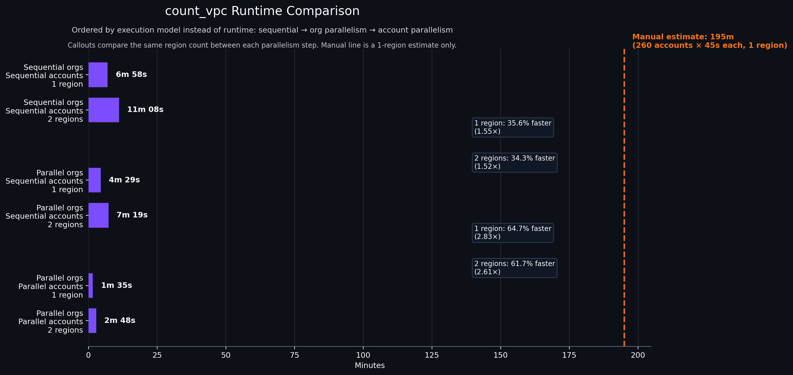

# anvil

<a name="readme-top"></a>

<!-- PROJECT SHIELDS -->
[![pytest][pytest-badge]][pytest-url]
[![ruff][ruff-badge]][ruff-url]
[![prek][prek-badge]][prek-url]


<!-- PROJECT LOGO -->
<br />
<div align="center">
    
  </a>

  <h3 align="center">README</h3>

  <p align="center">
    <a href="https://github.com/JSChronicles/anvil"><strong>Explore the docs »</strong></a>
    <br />
    <a href="https://github.com/JSChronicles/anvil/issues/new?labels=Bug%2CNeeds+Triage&projects=&template=bug.yaml&title=%5BBUG%5D+%3Ctitle%3E">Report Bug</a>
    ·
    <a href="https://github.com/JSChronicles/anvil/issues/new?labels=enhancement%2Cfeature+request&projects=&template=feature.yaml&title=%5BFEATURE%5D%3A+">Request Feature</a>
  </p>
</div>

## Introduction

Anvil is a declarative AWS execution engine for running Python tasks across large account and region fleets. Describe the work in YAML, keep task logic in plain Python modules, and let the engine handle authentication, role assumption, dependency ordering, bounded concurrency, and structured results so repeatable AWS work can run faster without turning orchestration into custom scripts.

For a deeper look at the execution flow, see the [in-depth Anvil README](in-depth.md).

## Why Anvil?

Anvil is built for teams that need repeatable AWS workflows, such as inventory, validation, enforcement, cleanup, and reporting, to run consistently across organizations, accounts, and regions.

- Declarative orchestration
  - Define execution in reusable YAML instead of one-off scripts.
  - Configure organizations, account lists, regions, tasks, task dependencies, dry runs, fail-fast behavior, and concurrency in one place.
- Multi-account and multi-organization by default
  - Automatically discover active accounts and enabled regions for each AWS Organization.
  - Run only against configured organization regions that are enabled, including regions selected by `all` or glob patterns.
  - Support explicit account groups and include/exclude filters.
  - Assume roles into member accounts.
  - Let account owners, admins, governance teams, and security teams run approved tasks at the scope they control.
- Bounded parallel execution
  - Run configured organizations or account groups concurrently with `max_parallel_targets`.
  - Run accounts inside each target concurrently with `max_workers`.
  - Run regions inside each account concurrently with `max_parallel_regions`.
  - Keep concurrency explicit so large runs are faster without accidental API pressure.
- Shared discovery and session reuse
  - Check organization identity, account discovery, and enabled-region discovery before execution.
  - Reuse discovery for repeated targets in the same organization.
  - Reuse sessions and clients while keeping credentials scoped to the correct account and region.
- Task isolation
  - Write tasks as simple Python files with a `run(...)` function.
  - Keep AWS business logic separate from authentication, role assumption, dependency ordering, result aggregation, and concurrency.
- Built-in and custom tasks
  - Use stock tasks for common AWS operations.
  - Add project-local tasks for team-specific work.
  - Extend the task set without changing the execution engine.
- Structured output and safer operations
  - Record structured results at task, account, target, and engine levels.
  - Write flattened JSONL results for quick filtering with `anvil results`.
  - Use auth checks, dry runs, dependency ordering, optional tasks, fail-fast controls, and cancellation handling for safer repeat runs.


### Repository template

Create your own dedicated task repository using the [foundry-anvil-template](https://github.com/JSChronicles/foundry-anvil-template). The template provides a ready project layout for custom tasks, YAML examples, validation, and CI outside of the main Anvil repository.


### Standalone Multi-Account Script Template

If you do not need/want the full Anvil framework and only want a simple starting point for small AWS Organization tasks, see the [standalone multi-account script template](https://github.com/JSChronicles/anvil/blob/main/templates/multi_aws_account_task_template.py).

This template provides:
- AWS Organizations account discovery
- active-account filtering
  - `--include` / `--exclude` account selection
- parallel per-account execution
  - multiple regions per account
- assume-role handling for member accounts
- dry-run support
- JSON result output

Replace the innards of the `account_task()` function with your own per-account logic.
Replace the `--example-piece` argparse and `example_piece` in other areas or edit as desired

## Example Benchmarks

To measure concurrency behavior, the engine was tested across 3 organizations with a combined 260 accounts using the `count_vpc` task. The comparison below shows the same kind of work moving from sequential execution to organization-level parallelism and then to account-level parallelism.

The fastest measured run in this benchmark completed 260 accounts in about 1m 35s for 1 region, compared with a 3h 15m manual sequential estimate at 45 seconds per account. With 2 regions, the parallel account run completed in about 2m 48s.

<p align="left">
  
</p>


## Usage
1. When using the uv tool, there are several ways to run and install dependencies. Here are a few examples:
   1. Manual setup (similar to pip-tools):
      1. Create a Python virtual environment: uv venv or python -m venv .venv
      1. Activate the virtual environment: .\.venv\Scripts\activate.ps1
      1. Install dependencies: uv pip install --requirements pyproject.toml
1. uv sync:
   1. Sync the project's dependencies with the environment: uv sync
   1. Activate the virtual environment: .venv\Scripts\activate
1. uv run:
   1. Run a command in the project environment.: `uv run example.py <args>`
      1. uv run anvil run --config-file ./yaml/orgs.yaml
   1. Note that if you use uv run in a project, i.e. a directory with a pyproject.toml, it will install the current project before running the script.


For a complete GitHub Actions example that runs Anvil with AWS OIDC and uploads
the generated JSON results as workflow artifacts, see
[`examples/github-actions`](https://github.com/JSChronicles/anvil/blob/main/examples/github-actions/README.md).

There are multiple global commands
```console
anvil auth …
anvil graph …
anvil results …
anvil tasks …
anvil run …
```

### Logging verbosity

The `run`, `auth check`, and `graph` commands support `--log-level` to control console output verbosity.

Supported values:
- `DEBUG`
- `INFO`
- `WARNING`
- `ERROR`
- `CRITICAL`

Examples:

```console
anvil run --config-file ./yaml/orgs.yaml --log-level ERROR
anvil auth check --config-file ./yaml/orgs.yaml --log-level WARNING
anvil graph --config-file ./yaml/orgs.yaml --log-level INFO
```

### Authentication

Authentication checks validate AWS credentials and access without executing any tasks.

```console
anvil auth check --help
```

Authenticate credentials from an organization file.
```console
anvil auth check --config-file ./yaml/orgs.yaml
```

Suppress all output and rely on the exit code only (useful for CI). See [Authentication output](in-depth.md#authentication-output) for detailed examples.
```console
anvil auth check --config-file orgs.yaml --quiet
```


### Graph
Display the resolved task dependency graph for an organization configuration. See [Graph output](in-depth.md#graph-output) for detailed examples.

```console
anvil graph --help
```

Generate a dependency graph from an organization file.
```console
anvil graph --config-file .\examples\07-optional-task-semantics.yaml
```

Output graph results as JSON.
```console
anvil graph --config-file .\examples\07-optional-task-semantics.yaml --json
```

### Task Management
List all available stock and user-defined tasks
```console
anvil tasks list

Available tasks:
plugin: my-test-project:
  - hello
  - test

stock:
  - compare_asg_to_cluster_instances
  - get_aws_inline_policies
  - get_organization_structure
  - noop
  - noop_fail
  - remove_iam_user
  - remove_missing_group_assignments
  ...
```

Validate all available stock and user-defined tasks:
```console
anvil tasks validate
[ERROR] task validation failed:
  - task 'cleanup' is missing required run() parameters: ['account_alias']
  - task 'inventory' is missing required run() parameters: ['metadata']
```

```console
anvil tasks validate
[OK] all tasks are valid
```

### Execution
Execute all configured organizations and accounts from one or more YAML files. See [Run output and result layout](in-depth.md#run-output-and-result-layout) for detailed examples.
```console
anvil run --help
```
Run a single YAML file
```console
anvil run --config-file ./yaml/orgs.yaml
```

To run multiple YAML files in one command, pass them after a single `--config-file` flag. They run sequentially in the order provided. Each YAML remains an isolated run with its own summary file, and the overall command exits non-zero if any YAML run fails.
```console
anvil run --config-file ./yaml/orgs.yaml ./yaml/orgs2.yaml ./yaml/orgs3.yaml
```

Anvil writes per-target full results, write a flattened query file, and produce one summary file per YAML in a run-scoped result directory:

```text
results/
  <config-stem>/
    <run-id>/
      summary.json
      results.jsonl
      organizations/
        <organization>.json
```

> [!NOTE]
> Use `--benchmark` only for performance investigations. It adds engine, target, account, region, and result-write timing details to result JSON, which can dramatically increase output size on large account, region, or task runs.
> Leave it off for normal audit/reporting runs, and enable it when comparing benchmark runs or looking for bottlenecks.


### Result Queries

Runs still write the existing full JSON result files. They also write JSONL records that flatten account and task results for quick filtering:
`./results/{config-stem}/{run-id}/results.jsonl`.

Common queries:

```console
# Show every failure under ./results.
anvil results --status failed

# Show failures for one organization or account-group target.
anvil results --target prod --status failed

# Show failed account records only.
anvil results --type account --status failed

# Show task records for one task name.
anvil results --type task --task count_vpcs

# Show task records for one AWS region.
anvil results --type task --region us-east-1

# Show a compact failure view with selected fields and a row limit.
anvil results --status failed --fields account_id,region,task,error --limit 20

# Emit failed task records as JSONL.
anvil results --type task --status failed --jsonl
```

Advanced queries:

```console
# Query one explicit run results file.
anvil results --status failed --results-file ./results/orgs/2026-05-01T183012Z/results.jsonl

# Query multiple explicit run results files in one command.
anvil results --status failed --results-file ./results/orgs/run-a/results.jsonl ./results/accounts/run-b/results.jsonl

# Filter one task in one target and print selected fields.
anvil results --type task --target prod --task count_vpcs --fields account_id,region,status,error

# Show failure rows with target, account, region, task, and error context.
anvil results --status failed --fields record_type,target,account_id,region,task,error

# Emit failed task rows as JSONL with only the selected fields.
anvil results --type task --status failed --fields account_id,region,error --jsonl

# Show the first 50 failure rows with target type context.
anvil results --status failed --fields target_type,target,account_id,task,error --limit 50
```

#### Rerun failures:
> [!NOTE]
> `--rerun` infers the rerun scope from result records. It reloads the original config, reruns only matching failed accounts, narrows to failed regions and tasks when task-level failures are available, and includes required task dependencies automatically.
> Use scope filters such as `--target`, `--account`, `--region`, and `--task` to limit a rerun even further. Report-shaping flags such as `--type`, `--fields`, `--limit`, `--json`, and `--jsonl` are not supported with `--rerun`.

```console
# Rerun failures from one explicit run results file.
anvil results --status failed --results-file ./results/orgs/2026-05-01T183012Z/results.jsonl --rerun

# Rerun failures from multiple explicit run results files in one command.
anvil results --status failed --results-file ./results/orgs/run-a/results.jsonl ./results/accounts/run-b/results.jsonl --rerun
```

The result query command supports `--type`, `--target`, `--account`,
`--region`, `--task`, `--status`, `--fields`, `--limit`, `--results-file` with
one or more JSONL paths, and `--json` or `--jsonl` for structured filtered
output. `--status failed` matches any non-success status. Without
`--results-file`, Anvil queries every `results.jsonl` file under `./results`.


### How task discovery works

Tasks are resolved in the following order:

Anvil discovers tasks from two sources:

- Stock tasks - tasks shipped with Anvil (anvil.tasks)

- Plugin tasks - tasks registered via the anvil.tasks entry-point group

Directories named `tasks/` are conventional only and are not automatically scanned.

#### Reference tasks in YAML
Once configured, custom tasks behave exactly like stock tasks:

```yaml
tasks:
  - name: inventory
  - name: cleanup
    depends_on: [inventory]
```


### Implement the Task Contract

Each task module must define a callable `run` function.
This is the minimum interface required for Anvil to discover and execute a task.

```python
from anvil.actions import ActionRecorder

def run(
    *,
    account_id: str,
    account_alias: str,
    session,
    dry_run: bool,
    metadata: dict[str, object],
    actions: ActionRecorder,
) -> None:
    """
    Execute the task for one AWS account-region pair.
    """
```

#### Arguments

- `account_id` - AWS account ID currently being processed.
- `account_alias` - Friendly name of the account.
- `session` - A boto3 Session already scoped to the target account and region.
- `dry_run` - Indicates whether the task should make changes.
- `metadata` - Organization metadata defined in the configuration file.
- `actions` - Action recorder provided by Anvil for planned or completed work.

The return value is optional. Any returned data may be included in execution results.

---

### Optional Helpers (Advanced Usage)

Tasks can use Anvil-provided utilities to produce structured results. `ActionRecorder` allows tasks to:

- record planned or executed actions
- produce structured output for reporting
- integrate with Anvil’s execution summaries

You can view returned-result and ActionRecorder examples in the [Results examples](https://github.com/JSChronicles/anvil/blob/main/examples/Results/README.md).


Using these utilities is **not required**, but recommended for tasks that modify infrastructure or need richer audit output.

<!-- MARKDOWN LINKS & IMAGES -->
[pytest-badge]:https://github.com/JSChronicles/anvil/actions/workflows/pytest.yaml/badge.svg?branch=main
[pytest-url]:https://github.com/JSChronicles/anvil/actions/workflows/pytest.yaml
[ruff-badge]:https://github.com/JSChronicles/anvil/actions/workflows/ruff.yaml/badge.svg?branch=main
[ruff-url]:https://github.com/JSChronicles/anvil/actions/workflows/ruff.yaml

[prek-badge]:https://img.shields.io/endpoint?url=https://raw.githubusercontent.com/j178/prek/master/docs/assets/badge-v0.json
[prek-url]:https://github.com/j178/prek
