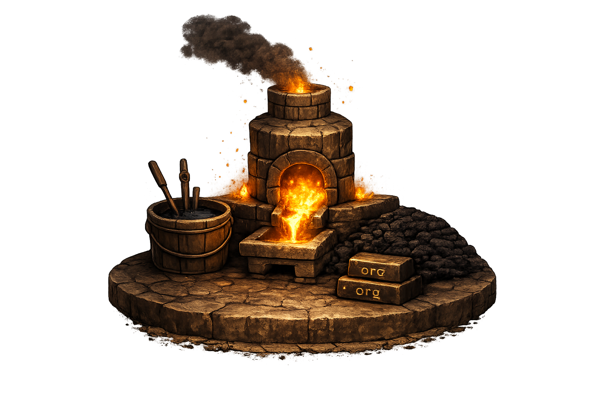

  <main class="landing-main">
    

      <section class="landing-hero" aria-labelledby="site-title">
        <h1 id="site-title">Ops Foundry</h1>
        
this just beginning.

      </section>

      <section class="coming-soon" aria-labelledby="coming-soon-title">
        <h2 id="coming-soon-title">Coming soon</h2>
        <ul class="soon-list">
          <li>
            <a class="project-card-link" href="anvil/">
              
                
                <strong>Anvil</strong>
              
              
A declarative execution engine for running Python tasks across AWS accounts, regions, and organizations.

              In testing
            </a>
          </li>
          <li>
            
              
              <strong>Foundry</strong>
            
            
A GitOps-driven infrastructure-as-code framework for managing GitHub organizations, repositories, rulesets, environments, and security policies at scale.

            Planned
          </li>
          <li>
            
              
              <strong>Forge</strong>
            
            
GitHub organizations managed by Foundry. Each forge owns the repositories, rules, environments, and policies for its org.

            Planned
          </li>
          <li>
            
              <strong>Guides and notes</strong>
            
            
Practical guides, templates, and engineering notes collected as the documentation hub grows.

            Later
          </li>
        </ul>
      </section>
    

  </main>

